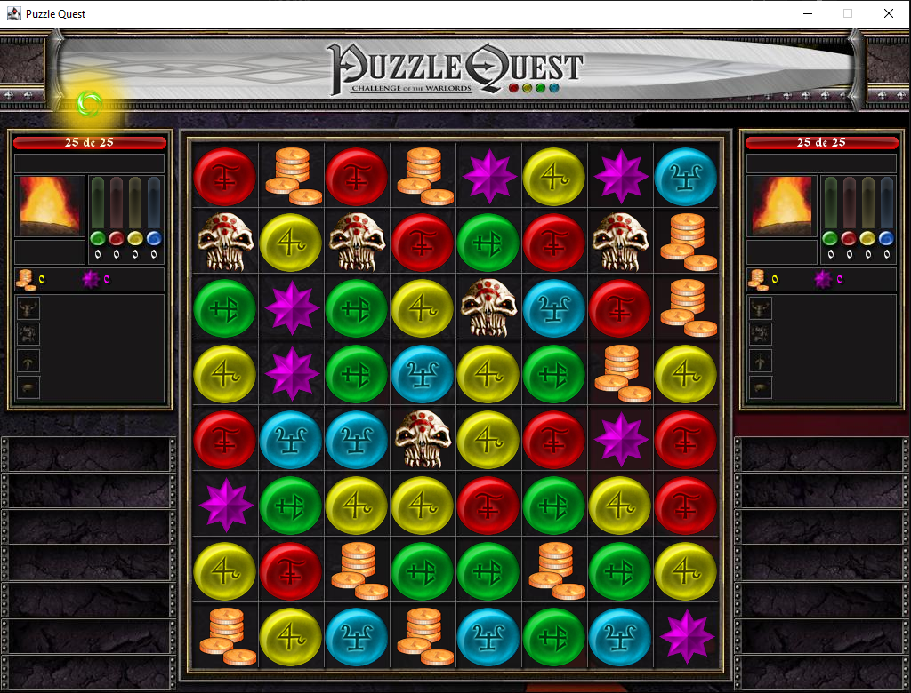

# Puzzle Quest Clone

This project is a faithful recreation of the classic puzzle RPG, **Puzzle Quest: Challenge of the Warlords**. It was undertaken as a college project to demonstrate proficiency in game development principles and techniques.

## Key Features:

- **Authentic Gameplay**: Replicates the core mechanics of the original game, including matching gems, building combos, and strategic combat.
- **Visual Fidelity**: Utilizes original textures and effects to provide an immersive gaming experience.
- **Customizable Difficulty**: Offers multiple difficulty levels to cater to players of all skill levels.
- **Save and Load**: Allows players to save their progress and resume their game at a later time.
- **User-Friendly Interface**: Intuitive controls and a clear user interface enhance the overall gameplay experience.

## Demo

## Technologies Used

- **Java** (Main programming language)
- **IntelliJ IDEA** (IDE used for development)
- **Swing** (For building the graphical user interface)
- **Custom Game Logic** (Implemented in Java for game mechanics)

## How to Play

1. Clone the repository.
2. Open the project in **IntelliJ IDEA**.
3. Run the **Game** Java file to start the game.

## Installation

1. Clone or download the repository to your local machine.
2. Open the project in **IntelliJ IDEA**.
3. Ensure you have **Java 8** or higher installed.
4. Build and run the project through **IntelliJ IDEA** to start the game.

## License

This project is licensed under the MIT License - see the [LICENSE](LICENSE) file for details.
